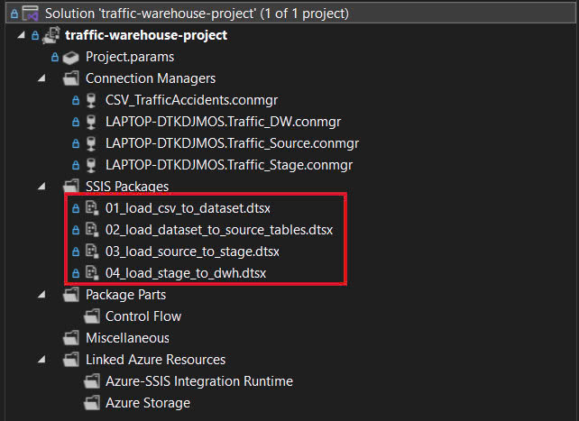
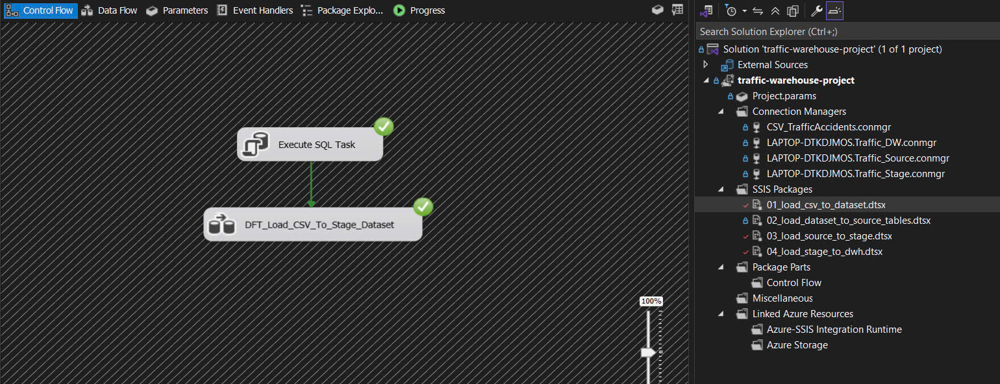
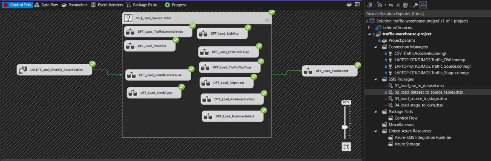
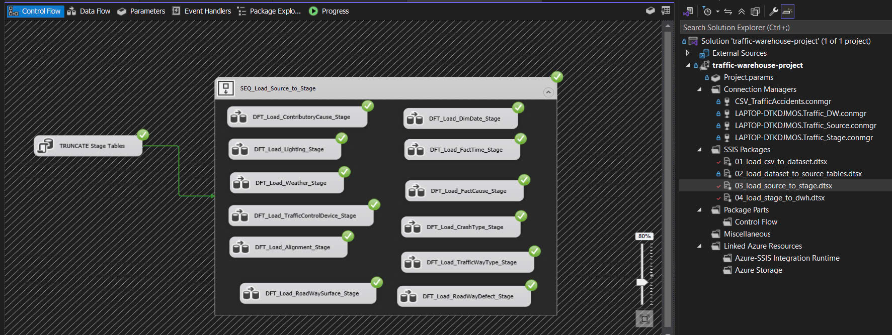
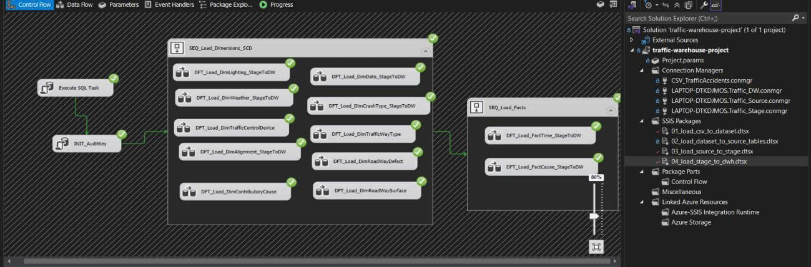

# Traffic Accident Data Warehouse (SSIS)

This project implements a complete ETL pipeline using **SQL Server Integration Services (SSIS)** to build a star-schema data warehouse for analyzing **traffic accident data**.

## 📊 Overview

* **Source**: Raw traffic accident data from `TrafficAccidents.csv`  
* **ETL Pipeline**: CSV → Dataset → Source → Stage → Data Warehouse  
* **Tools Used**: SSIS, SQL Server, T-SQL

The solution enables structured, clean, and analytical-ready data for downstream reporting and dashboarding.

## ⚙️ ETL Architecture

         +----------------------+       
         | TrafficAccidents.csv |
         +----------------------+
                  ↓
       [01] Load to Dataset (Raw)
                  ↓
       [02] Normalize into Source Tables
                  ↓
       [03] Transform to Stage
                  ↓
       [04] Load to Data Warehouse (Star Schema)

---

## 📦 SSIS Packages Overview

The project includes 4 main SSIS packages, each representing a specific stage in the ETL process:

| Package                                 | Description                                            |
| --------------------------------------- | ------------------------------------------------------ |
| `01_load_csv_to_dataset.dtsx`           | Load raw CSV into staging table                        |
| `02_load_dataset_to_source_tables.dtsx` | Normalize into dimension & event tables                |
| `03_load_source_to_stage.dtsx`          | Prepare cleaned, joined data for DW                    |
| `04_load_stage_to_dwh.dtsx`             | Final load into DW with surrogate keys, SCD, and audit |

📸 **Visual Studio – All SSIS Packages**

---

## ✅ Package Execution Screenshots

Screenshots of successful package execution:

**1. Load CSV to Dataset**  

**2. Load Dataset to Source Tables**  

**3. Load Source to Stage**  

**4. Load Stage to Data Warehouse**  

---

## 🏗️ Data Warehouse Schema

### 🔷 Fact Tables
- `FactTime`: facts about crash time
- `FactCause`: facts related to crash causes

### 🔶 Dimension Tables
- `DimDate`
- `DimCrashType`
- `DimLighting`
- `DimWeather`
- `DimTrafficControl`
- `DimAudit`

---

## ▶️ How to Run

1. Open `traffic-warehouse-project.sln` in Visual Studio with SSIS extension  
2. Configure the following Connection Managers:
   - `CSV_TrafficAccidents.conmgr`
   - `Traffic_Source.conmgr`
   - `Traffic_Stage.conmgr`
   - `Traffic_DW.conmgr`
3. Run the packages in order:  
   `01` → `02` → `03` → `04`  
4. Verify output in `Fact` and `Dim` tables inside your target DW

---

## 📈 Outcome

The final warehouse enables fast, reliable analytics on traffic crash data:
- Crash frequency by time, weather, and lighting conditions
- Time-based trend reports
- Historical dimension tracking via SCD Type 2
---

## Authors

- **Hung Nguyen** – [@hungfnguyen](https://github.com/hungfnguyen)
